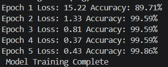

# Cinemood - Mood-Based Video Classification

## Overview

Cinemood is a machine learning project that classifies videos into different moods such as Happy, Sad, Action, and Horror.

## Features

* Extracts frames from videos
* Processes and organizes dataset
* Trains a classification model
* Predicts mood from input video

## Tech Stack

* Python
* OpenCV
* TensorFlow / PyTorch

## Project Structure

* train_model.py - Train the model
* predict_mood.py - Predict mood
* extract_all_frames.py - Frame extraction
* organize_dataset.py - Dataset preparation

## Dataset

Dataset is not included due to size.
(Add your dataset link here)

## How to Run

pip install -r requirements.txt
python train_model.py
python predict_mood.py

## Results

## Demo  

## Demo

This project can be tested locally by running:

python train_model.py  
python predict_mood.py
